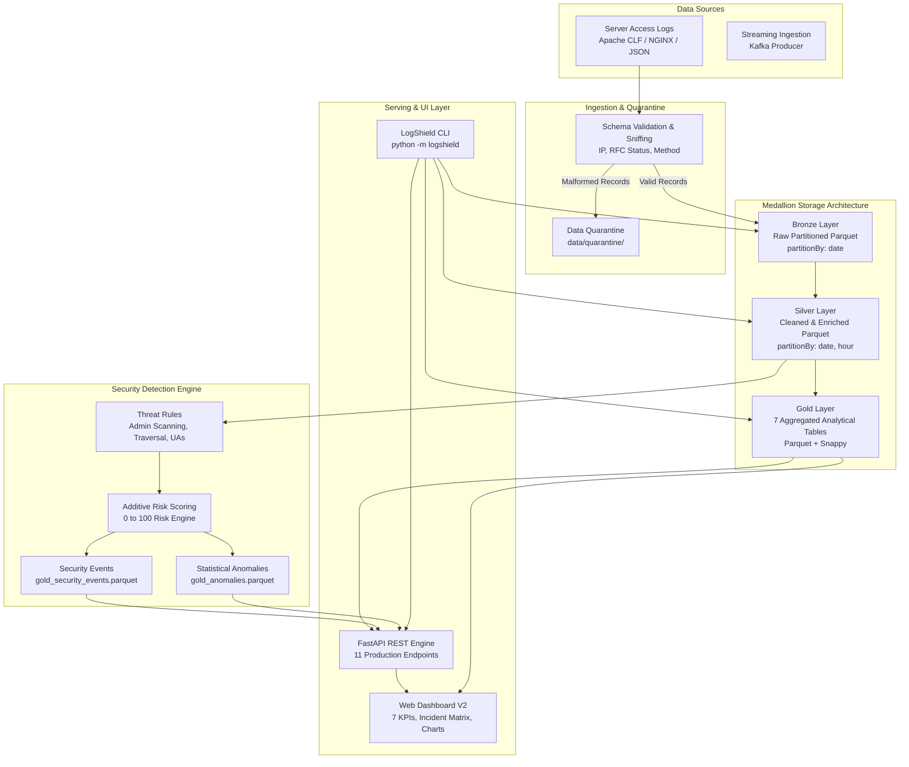

# 🏛️ LogShield System Architecture

LogShield is a production-grade, distributed big data log analytics and security threat intelligence platform. It transforms standard enterprise web server access logs into partitioned analytical lakehouse tables, real-time threat detection alerts, and an executive dashboard.

---

## 1. High-Level Architectural Diagram

---

## 2. Storage Layers (Medallion Architecture)

### 🥉 Bronze Layer (`data/bronze/`)
* **Format**: Apache Parquet with Snappy compression.
* **Partitioning**: Partitioned by calendar date (`date=YYYY-MM-DD`).
* **Content**: Raw ingested log records preserved verbatim with standardized column headers (`timestamp`, `ip`, `method`, `path`, `protocol`, `status`, `response_bytes`, `source_file`, `ingestion_time`).
* **Integrity**: Non-compliant records are routed directly to `data/quarantine/`.

### 🥈 Silver Layer (`data/silver/`)
* **Format**: Apache Parquet with Snappy compression.
* **Partitioning**: Dual-level partitioned by `date` and `hour` (`date=YYYY-MM-DD/hour=H`).
* **Transformations**:
  - Filter out invalid status codes and unroutable IPs.
  - Normalized UTC timestamps.
  - Cleaned URI paths without tracking query strings.
  - Deduped records based on transaction signatures.

### 🥇 Gold Layer (`data/gold/`)
Pre-computed analytical aggregations optimized for sub-millisecond BI dashboard querying:
1. `gold_hourly_traffic.parquet`: 24-hour total volume, error counts, and error percentages.
2. `gold_status_distribution.parquet`: Status code distribution (200, 301, 403, 404, 500).
3. `gold_404_paths.parquet`: Broken requested paths ranked by hit volume.
4. `gold_daily_errors.parquet`: Day-by-day error trajectory.
5. `gold_404_heatmap.parquet`: Cross-tabulated Day of Week vs. Hour of Day failure intensity matrix.
6. `gold_top_ips.parquet`: Top 50 client IPs with computed risk scores.
7. `gold_top_urls.parquet`: Top requested endpoints across all status codes.
8. `gold_kpis.json`: Executive metadata KPIs.

---

## 3. Real-Time Streaming Pipeline

For streaming environments, LogShield incorporates Apache Kafka and PySpark Structured Streaming:
1. **Producer (`LogProducer`)**: Publishes incoming access logs to Kafka topic `server-logs`.
2. **PySpark Structured Streaming (`run_streaming_job`)**: Reads from Kafka using Catalyst expression parsing.
3. **Windowing & Watermarking**:
   - Tumbling 5-minute windows with 10-minute watermarks to aggregate failure rates.
   - Sliding 10-minute windows with 2-minute slide intervals to detect bot scans and sudden request spikes.

---

## 4. Threat Intelligence Engine

LogShield uses an empirical, transparent rule-based risk evaluation model:
* **Admin Probing**: Detection of requests targeting sensitive admin interfaces (`/admin/login`, `/wp-login.php`, `/.env`).
* **Path Traversal**: Regex pattern matching for directory traversal (`../`, `/etc/passwd`).
* **Reconnaissance Bots**: Scanner user-agent matching (`sqlmap`, `nikto`, `masscan`).
* **Scoring (0–100)**: Additive penalty points categorized into LOW, MEDIUM, HIGH, and CRITICAL.
* **Automated Mitigation**: Outputs `iptables` drop commands and `fail2ban` rules per flagged actor.

---

## 5. Serving & Presentation Layer

* **FastAPI Backend**: Asynchronous REST API serving 11 endpoints with automatic OpenAPI documentation.
* **Dashboard V2**: Modern HTML5/Tailwind/Chart.js dashboard featuring:
  - 7 Executive KPI Cards
  - Interactive 24-Hour Peak Failure Bar Chart
  - HTTP Status Donut Chart
  - 7x24 Failure Intensity Heatmap with Cell Inspector
  - Dedicated Security Incident Intelligence Table
  - Top Client IP Threat Matrix with Quick WAF Block Buttons
  - Live Log Explorer with multi-column filtering and pagination
  - Dual Mode: Dynamic FastAPI connectivity with zero-dependency static JSON fallback.
